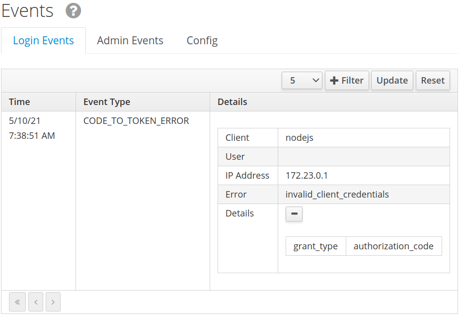

# Setup

Install [docker](https://docs.docker.com/get-docker/) and [docker-compose](https://docs.docker.com/compose/install/), then:
```
git clone https://github.com/SlausB/keycloak-nodejs-boilerplate.git
cd keycloak-nodejs-boilerplate
./run.sh
```
### Register or Create <b>Alice</b> user
- Open http://localhost:8080/auth/admin
- Enter `admin`/`admin`
- `Users` -> `Add user` -> Username: `Alice` -> Save
- ... `Credentials`:
    - `Password`: `password`
    - `Password Confirmation`: `password`
    - `Set Password`
    - `Temporary` -> `Off`
### Try it
Open http://localhost:8198/ in browser:
It will ask for login/password: enter `Alice`/`password` -> `Access denied` page bangs. `keycloak-connect` outputs `Could not obtain grant code: Error: 401:Unauthorized` to console while `Keycloak` says `WARN  [org.keycloak.events] (default task-8) type=CODE_TO_TOKEN_ERROR, realmId=kingdom, clientId=nodejs, userId=null, ipAddress=172.23.0.1, error=invalid_client_credentials, grant_type=authorization_code` logging event:


# How Keycloak was configured

- `Master` -> `Add realm` -> Name: `kingdom`
- `Clients` -> `Create` -> Client ID: `nodejs`
- `Clients` -> `nodejs` -> `Settings`:
    - `Access Type`: <b>confidential</b>
    - `Valid Redirect URIs`: <b>*</b>